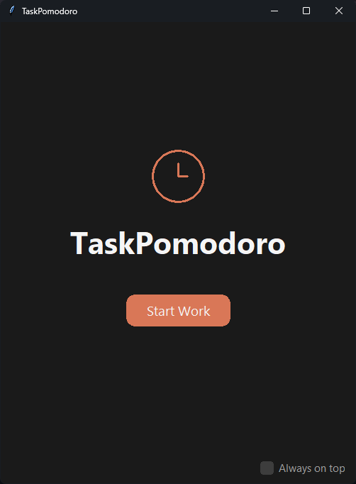
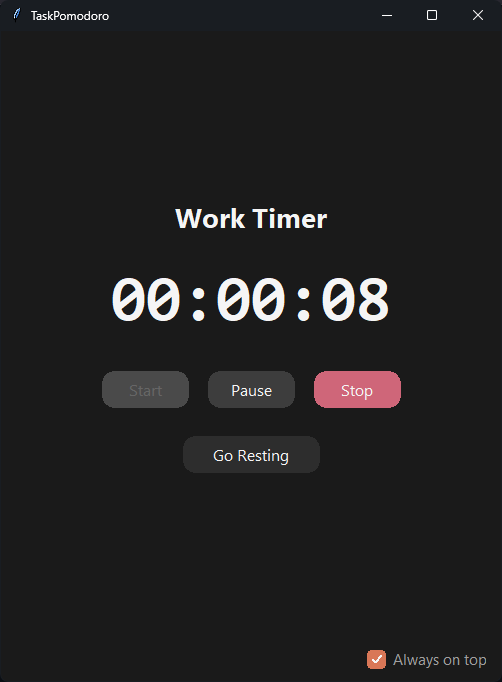
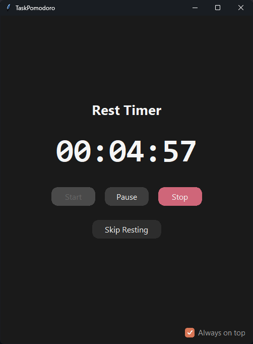

# 🍅 TaskPomodoro

A modern, elegant Pomodoro Timer desktop application built with Python and Tkinter.


## ✨ Features

- **🎯 Work Timer** - Track your focused work sessions with an upward-counting timer
- **😴 Rest Timer** - Automatic rest duration calculation (5 min per 25 min worked)
- **🔔 System Notifications** - Get notified every hour and when rest is complete
- **📌 Always on Top** - Keep the timer visible while working
- **🎨 Modern Dark UI** - Beautiful Claude-inspired dark grey theme
- **💾 Lightweight** - No external dependencies for core functionality

## 📸 Screenshots

| Starting Page                          | Work Timer                           | Rest Timer                           |
| -------------------------------------- | ------------------------------------ | ------------------------------------ |
|  |  |  |

## 🚀 Quick Start

### Prerequisites

- Python 3.9 or higher
- Tkinter (usually included with Python)

### Installation

1. **Clone the repository**

   ```bash
   git clone https://github.com/yourusername/taskpomodoro.git
   cd taskpomodoro
   ```

2. **Create a virtual environment** (recommended)

   ```bash
   python -m venv venv

   # Windows
   venv\Scripts\activate

   # macOS/Linux
   source venv/bin/activate
   ```

3. **Install dependencies**

   ```bash
   pip install -r requirements.txt
   ```

4. **Run the application**
   ```bash
   python -m src.main
   ```

## 🏗️ Project Structure

```
taskpomodoro/
├── src/
│   ├── __init__.py
│   ├── main.py              # Application entry point
│   ├── core/
│   │   ├── __init__.py
│   │   ├── app.py           # Main application class
│   │   ├── state.py         # Application state management
│   │   ├── timer.py         # Timer logic
│   │   └── notifications.py # System notifications
│   ├── ui/
│   │   ├── __init__.py
│   │   ├── theme.py         # Colors and styling
│   │   ├── widgets/
│   │   │   ├── __init__.py
│   │   │   ├── button.py    # Custom rounded button
│   │   │   ├── checkbox.py  # Modern checkbox
│   │   │   ├── clock_icon.py# Clock icon widget
│   │   │   ├── toast.py     # Toast notifications
│   │   │   └── dialog.py    # Custom dialogs
│   │   └── pages/
│   │       ├── __init__.py
│   │       ├── base_page.py # Base page class
│   │       ├── starting_page.py
│   │       ├── working_page.py
│   │       └── resting_page.py
│   └── utils/
│       ├── __init__.py
│       └── formatting.py    # Utility functions
├── assets/
│   ├── icon.ico             # Windows icon
│   ├── icon.png             # App icon
│   └── screenshots/         # Screenshots for README
├── scripts/
│   ├── build_windows.py     # Windows build script
│   └── build_windows.bat    # Windows build batch file
├── tests/
│   └── ...                  # Unit tests
├── requirements.txt         # Python dependencies
├── requirements-dev.txt     # Development dependencies
├── pyproject.toml          # Project configuration
├── setup.py                # Setup script
├── README.md               # This file
└── LICENSE                 # MIT License
```

## 🔧 Building for Windows

### Option 1: Using the build script

```bash
# Install build dependencies
pip install -r requirements-dev.txt

# Run the build script
python scripts/build_windows.py
```

### Option 2: Using PyInstaller directly

```bash
pip install pyinstaller

pyinstaller --onefile --windowed --icon=assets/icon.ico --name=TaskPomodoro src/main.py
```

The executable will be created in the `dist/` folder.

### Option 3: Using the batch file (Windows)

```batch
scripts\build_windows.bat
```

## 🎨 Customization

### Changing Colors

Edit `src/ui/theme.py` to customize the color palette:

```python
class Colors:
    BG_PRIMARY = "#1a1a1a"      # Main background
    ACCENT_WARM = "#d97757"      # Warm accent (buttons)
    ACCENT_COOL = "#6b9fbe"      # Cool accent (rest mode)
    # ... more colors
```

### Changing Timer Calculations

Edit `src/utils/formatting.py` to modify rest duration calculation:

```python
def calculate_rest_duration(work_seconds: int) -> int:
    work_minutes = work_seconds // 60
    # Customize your rest calculation here
    rest_minutes = max(5, (work_minutes // 25) * 5)
    return rest_minutes * 60
```

## 🧪 Running Tests

```bash
# Install test dependencies
pip install -r requirements-dev.txt

# Run tests
pytest tests/
```

## 📝 Usage Guide

1. **Start Working**: Click "Start Work" on the home screen
2. **Control Timer**: Use Start/Pause/Stop buttons to control the timer
3. **Take a Break**: Long-press "Go Resting" to start your rest period
4. **Stay Focused**: Check "Always on top" to keep the window visible
5. **Get Notified**: Receive notifications every hour and when rest ends

## 🤝 Contributing

Contributions are welcome! Please feel free to submit a Pull Request.

1. Fork the repository
2. Create your feature branch (`git checkout -b feature/AmazingFeature`)
3. Commit your changes (`git commit -m 'Add some AmazingFeature'`)
4. Push to the branch (`git push origin feature/AmazingFeature`)
5. Open a Pull Request

## 📄 License

This project is licensed under the MIT License - see the [LICENSE](LICENSE) file for details.

## 🙏 Acknowledgments

- Inspired by the Pomodoro Technique® by Francesco Cirillo
- UI design inspired by Claude AI's interface
- Original Flutter implementation by [@andreicosmin02](https://github.com/andreicosmin02)

---

<p align="center">Made with ❤️ and Python</p>
